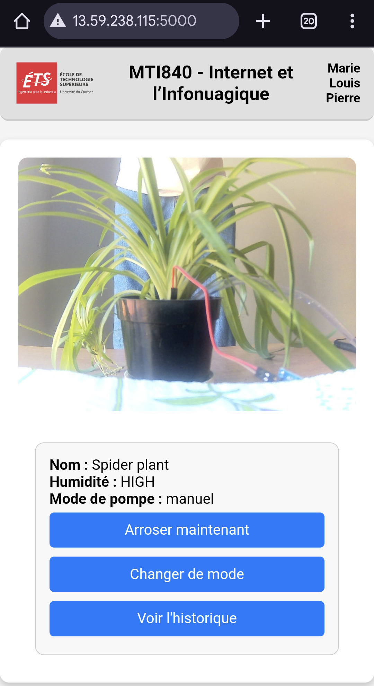

# AWS EC2 Serveur – Arrosage Automatique

Ce serveur Flask héberge l'interface web de gestion d’un système d’arrosage automatique connecté à une Raspberry Pi. Il permet la réception de données capteurs, de frames caméra, le déclenchement de la pompe et l'affichage des logs.

---

## Aperçu de l'interface




## Prérequis

- Instance AWS EC2 (Ubuntu recommandé)
- Python 3 installé

---

## Installation

### 1. Créer un environnement virtuel Python

```bash
python3 -m venv mpl_env
source mpl_env/bin/activate
```

### 2. Installer les dépendances Python

```bash
pip install flask requests flask-sqlalchemy
```

### 3. Installer SQLite

```bash
sudo apt update
sudo apt install sqlite3
```

---

## Structure du projet

- `app.py` : script principal Flask
- `templates/index.html` : interface utilisateur
- `instance/watering.db` : base de données SQLite (créée automatiquement)
- `static/` : fichiers image / vidéo uploadés
- `templates/` : contient `index.html`

---

## Mise en place de la base de données SQLite

### 1. Lancer Python dans le terminal

```bash
python3
```

### 2. Exécuter :

```python
from app import db, app

with app.app_context():
    db.create_all()
```

> Cela crée la base de données `watering.db` avec une table `WateringLog`.

---

## Tester la base de données

### Ajouter un arrosage test :

```python
from app import log_watering, app

with app.app_context():
    log_watering("Test arrosage")
```

### Vérifier le contenu de la base :

```python
from app import WateringLog, app

with app.app_context():
    print(WateringLog.query.all())
```

---

## Lancer le serveur Flask

Assure-toi d’être dans ton environnement virtuel :

```bash
source mpl_env/bin/activate
python3 app.py
```

---

## Rendre Flask actif en arrière-plan avec `screen`

### 1. Installer `screen` (si nécessaire)

```bash
sudo apt install screen -y
```

### 2. Créer une session `screen`

```bash
screen -S flask_app
```

### 3. Lancer Flask dans `screen`

```bash
source mpl_env/bin/activate
python3 app.py
```

### 4. Détacher `screen` (laisser tourner Flask même après fermeture SSH)

Appuie sur :
```
CTRL + A puis D
```

### 5. Revenir dans `screen` plus tard

```bash
screen -r flask_app
```

### 6. Voir toutes les sessions `screen` actives

```bash
screen -ls
```

### 7. Quitter proprement

Revenir dans `screen` :

```bash
screen -r flask_app
```

Puis arrêter Flask avec :
```
CTRL + C
```

Et quitter `screen` avec :
```bash
exit
```
